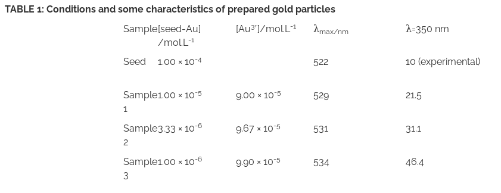

 **Kinetic Study of Catalytic Reduction Eosin:**  
    
1. Prepare gold seed particles and larger gold particles of three different sizes from these seed particles by using a two-step seed mediated (non-iterative) growth method. See ‘Molecular Absorption Spectroscopy’ VLab for the preparation of gold seed particles and various-sized colloidal gold particles. The conditions for preparing gold particles of three different sizes are given in Table 1.  
After the preparation of the particles, leave them for ~12 hrs before using them as catalysts. The rate of catalysis was found to be very slow within 3 – 4 hrs of their preparations.       
2. Turn on the spectrophotometer by clicking on the power button and wait for 30 min for initialization of the instrument.      
3. Take 2 mL of a sample containing particles of a given average size in a cuvette.      
4. Click on the micropipette to add 0.04 mL 10-2 M eosin solution and then 0.40 mL 0.50 M sodium borohydride (NaBH4) solution to the particle solution present in the cuvette.      
5. Immediately after the addition of NaBH4, kinetics of particle catalysed eosin reduction is followed by following the decrease in absorbance value at λ=535 nm with time (at 30 ± 1°C).      
6. Click on the spectrophotometer lid to open it.      
7. Click on the cuvette to place it in the sample cell holder of the instrument. One has to use water as the sample blank or reference in this measurement. Here a double beam spectrophotometer is shown. In this case, one can place the sample in the sample holder and the sample bank or reference in the reference holder simultaneously.      
8. Close the spectrophotometer lid by clicking on it.      
9. Run the scan in the kinetics mode by clicking on the Computer monitor and then on the 'Scan' tab and observe the scan. In the real spectrophotometer, an appropriate wavelength of light is selected (here λ=535 nm) at which the decrease in absorbance vs. time scan is performed by using the accompanied computer software.      
10. When the scan is complete click on the 'Next' tab for beginning the kinetic measurements with Sample 2 and Sample 3.      
11. Repeat the above steps and study the kinetics of catalytic reduction of eosin in the presence of Sample 2 and then Sample 3 gold particles.      
12. Collect data by clicking on the 'Data' tab.      
13. Plot the absorbance vs. time for every sample. What is the nature of the plot?      
14. Attempt first order fits of the data and calculate the rate constants.    
15. Plot the rate constant vs. average particle size of the catalyst samples. Discuss your results.  

 

